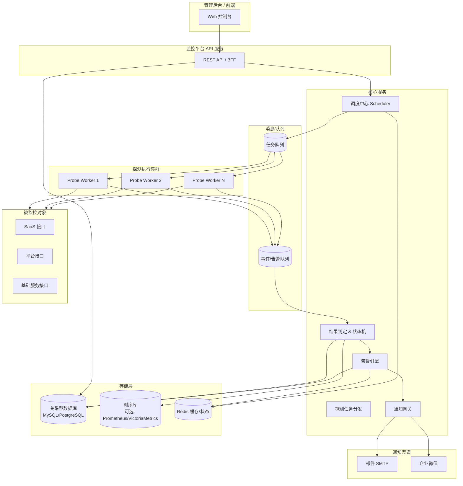
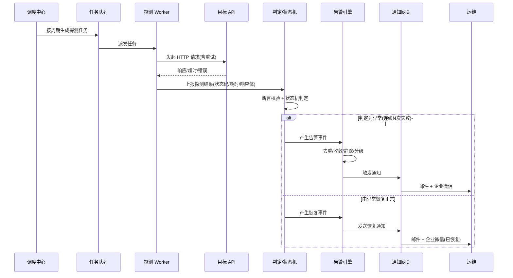
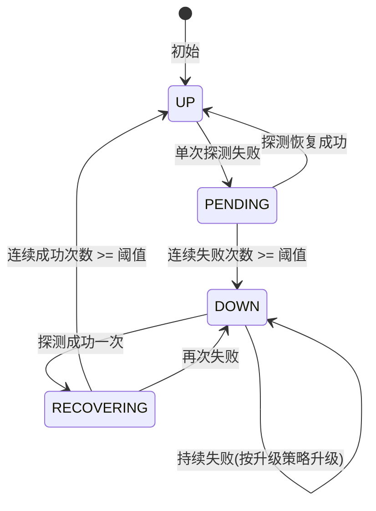

# API 接口级监控告警系统 — 总体方案设计

> 版本：v1.0　　状态：设计稿（暂不开发）
> 适用范围：公司 SaaS 软件、平台级软件及其背后的各类基础服务

---

## 1. 背景与目标

公司对外提供 SaaS 与平台级软件，背后由大量基础服务（鉴权、网关、消息、存储、计费等）支撑。目前缺乏统一的、**细粒度到单个 API 接口**的可用性监控手段，一旦某个接口不可访问或返回异常，往往依赖用户反馈才被发现，响应滞后。

本方案的目标是建立一套**主动式 API 拨测监控告警系统**，实现：

1. **接口级监控**：以单个 HTTP/HTTPS API 接口为最小监控单元，覆盖可用性、状态码、响应时间、返回内容校验。
2. **实时告警**：接口不可访问 / 超时 / 返回错误时，第一时间通知运维。
3. **多渠道通知**：支持**邮件**与**企业微信**（可扩展短信、钉钉、电话等）。
4. **数据可管理**：所有监控对象、探测结果、告警记录、通知配置都持久化在数据库中，并提供后台管理界面。

### 1.1 核心需求拆解

| 需求 | 说明 |
| --- | --- |
| 接口可访问性 | 探测目标接口能否建立连接、是否超时、DNS/TLS 是否正常 |
| 返回错误检测 | HTTP 状态码非预期（如 5xx、4xx）、响应体不符合断言规则、业务错误码异常 |
| 性能监控 | 响应时间超过阈值（慢响应也视为异常）|
| 实时通知 | 满足告警条件后秒级 ~ 分钟级触发通知 |
| 多渠道 | 邮件、企业微信（机器人 / 应用消息）|
| 告警治理 | 去重、收敛、静默、升级、恢复通知，避免告警风暴 |
| 数据管理 | 监控项 CRUD、历史数据查询、告警记录、通知策略管理 |

### 1.2 非功能性需求

- **高可用**：监控系统自身不能成为单点；调度与探测可水平扩展。
- **低误报**：通过多次重试 + 多点确认 + 状态机降低瞬时抖动造成的误报。
- **可扩展**：监控目标从数十到数千接口可平滑扩容；通知渠道可插拔。
- **安全**：敏感配置（密钥、Token、企业微信密钥）加密存储；最小权限。
- **可观测**：监控系统自身具备自监控与心跳上报。

---

## 2. 总体架构

整体采用「**调度中心 + 分布式探测器 + 告警引擎 + 通知网关 + 管理后台**」的分层架构。

### 2.1 数据流（一次探测的生命周期）

---

## 3. 核心模块设计

### 3.1 监控目标管理（Monitor Target）

监控的最小单元是 **监控项（Monitor）**，描述「对哪个接口、用什么方式、按什么频率、用什么规则判定健康」。

一个监控项的关键属性：

- **基本信息**：名称、所属服务 / 业务线、负责人、环境（生产/预发/测试）。
- **请求定义**：URL、HTTP 方法、Header、Query、Body、超时时间、是否跟随重定向、TLS 校验开关。
- **认证方式**：无 / Basic / Bearer Token / 自定义 Header / OAuth（密钥从加密配置读取）。
- **探测频率**：如 30s / 1min / 5min（Cron 或固定间隔）。
- **健康判定规则（断言）**：
  - 状态码断言：期望 `200` 或 `2xx`，或在白名单集合内。
  - 响应时间断言：`< 阈值ms`（如 P95 < 800ms）。
  - 响应体断言：JSONPath / 正则 / 包含关键字 / 业务码字段（如 `code == 0`）。
- **告警策略关联**：连续失败次数阈值、告警等级、通知接收人/组、静默时段。

### 3.2 调度中心（Scheduler）

- 负责按每个监控项的频率，周期性生成探测任务投递到任务队列。
- 采用**分布式调度**（如 基于 Redis 的分布式锁 / Quartz 集群 / XXL-JOB），避免多实例重复调度。
- 支持任务分片：按监控项 ID 哈希分配到不同 Worker，支撑大规模监控项。
- 支持「**多探测点 / 多地域**」：同一接口可由多个区域的 Worker 探测，避免单点网络问题误报。

### 3.3 探测执行器（Probe Worker）

- 无状态、可水平扩展，从任务队列消费探测任务。
- 执行 HTTP(S) 请求，记录：是否连通、DNS 耗时、TCP 连接耗时、TLS 握手耗时、首字节时间(TTFB)、总耗时、状态码、响应体（按需截断）。
- **本地重试机制**：单次任务内失败立即重试 N 次（如 2 次，间隔 1~2s），过滤瞬时抖动。
- 将探测结果写入事件队列，交由判定模块处理。
- 探测结果同时可写入时序库用于趋势分析（响应时间曲线、可用率 SLA）。

### 3.4 结果判定与状态机（Evaluator）

为避免「单次失败即告警」的误报，引入**状态机 + 连续计数**：

- `UP`（正常）/ `PENDING`（疑似异常）/ `DOWN`（确认故障）/ `RECOVERING`（恢复中）。
- 进入 `DOWN` 时产生**告警事件**；从 `DOWN` 回到 `UP` 时产生**恢复事件**。
- 多探测点场景下可配置「多数点失败才判定 DOWN」，进一步降低误报。

### 3.5 告警引擎（Alert Engine）

负责把「告警事件」转化为「实际通知」，关键能力：

- **去重 / 收敛**：同一监控项在故障未恢复期间，不重复轰炸；按时间窗口（如每 10 分钟提醒一次）或升级时再次通知。
- **分级（Severity）**：P0/P1/P2/P3，不同等级对应不同通知渠道与接收人。
- **告警升级（Escalation）**：故障持续 X 分钟未恢复，升级通知到上级 / 增加电话渠道。
- **静默 / 维护窗口（Silence / Maintenance）**：发布或维护期间屏蔽指定监控项告警。
- **抑制（Inhibition）**：上游基础服务故障时，抑制下游派生告警，避免风暴。
- **恢复通知**：故障恢复后主动发送「已恢复」通知并附带故障持续时长。

### 3.6 通知网关（Notification Gateway）

统一的通知抽象层，渠道可插拔。详见 `02-通知渠道设计.md`。

- 邮件：SMTP 发送，支持 HTML 模板、抄送、附件（如错误详情）。
- 企业微信：群机器人 Webhook（简单）或企业微信应用消息（可 @ 到人、按部门发送）。
- 统一的**通知模板引擎**（变量替换：服务名、接口、错误信息、时间、持续时长、详情链接）。
- **发送结果回执**：记录每次通知是否成功，失败自动重试 + 兜底渠道。

### 3.7 管理后台（Web 控制台）

- 监控项管理：增删改查、批量导入（Excel/JSON/OpenAPI 导入）、启停。
- 实时大盘：服务健康总览、故障列表、可用率（SLA）报表、响应时间趋势。
- 告警记录：告警/恢复历史、确认（Ack）、处理备注。
- 通知策略：接收人/组管理、渠道配置、静默/维护窗口配置。
- 权限管理：基于 RBAC（管理员 / 运维 / 只读）。

---

## 4. 关键设计决策与防误报策略

| 问题 | 设计对策 |
| --- | --- |
| 网络瞬时抖动误报 | Worker 内重试 + 状态机连续失败计数 + 多探测点确认 |
| 告警风暴 | 去重、收敛、抑制、静默、按窗口提醒 |
| 监控系统自身故障 | 自监控心跳、调度/Worker 多实例、看门狗（Dead Man's Switch）|
| 发布期间大量告警 | 维护窗口 / 静默规则，CI 发布时自动开启静默 |
| 敏感信息泄露 | 密钥加密存储、响应体脱敏与截断、最小权限 |
| 大规模监控项性能 | 任务分片、队列削峰、时序库存历史、关系库存元数据 |

---

## 5. 相关文档

- `02-通知渠道设计.md`：邮件与企业微信通知的详细设计与示例。
- `03-数据库设计.md`：完整数据库表结构（DDL）与字段说明。
- `04-技术选型与部署.md`：技术栈、部署架构、安全、实施路线图。
- `05-API接口设计.md`：监控平台自身对外提供的 REST API 设计。
