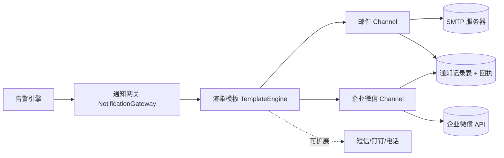
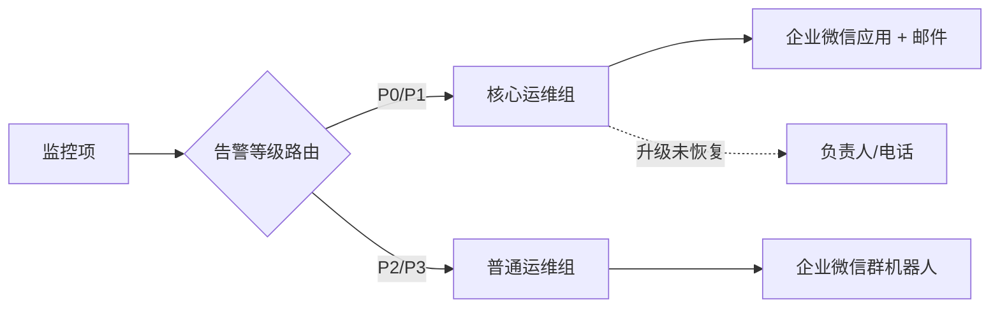

# 通知渠道设计 — 邮件 & 企业微信

> 配套文档：`01-总体方案设计.md`

本系统采用**统一通知抽象层（Notification Gateway）**，所有渠道实现同一接口，便于扩展（后续可加短信、钉钉、电话、Slack 等）。



统一渠道接口（伪代码）：

```text
interface NotifyChannel {
    type(): "email" | "wecom_robot" | "wecom_app"
    send(message: RenderedMessage, receivers: Receiver[]): SendResult
}
```

---

## 1. 通知内容模板

通知模板支持变量替换，告警与恢复使用不同模板。

**可用变量**：

| 变量 | 含义 |
| --- | --- |
| `{{service}}` | 所属服务 / 业务线 |
| `{{monitor_name}}` | 监控项名称 |
| `{{url}}` | 被监控接口地址 |
| `{{method}}` | 请求方法 |
| `{{severity}}` | 告警等级（P0~P3）|
| `{{status}}` | 当前状态（DOWN / RECOVERED）|
| `{{error}}` | 错误摘要（超时 / 状态码 / 断言失败）|
| `{{http_code}}` | 实际返回状态码 |
| `{{latency}}` | 响应耗时 |
| `{{first_seen}}` | 故障首次发现时间 |
| `{{duration}}` | 故障持续时长（恢复通知用）|
| `{{detail_url}}` | 监控平台详情页链接 |

**告警模板示例（文本）**：

```text
【API告警·{{severity}}】{{service}} 接口异常
监控项：{{monitor_name}}
接口：{{method}} {{url}}
错误：{{error}}（HTTP {{http_code}}，耗时 {{latency}}ms）
首次发现：{{first_seen}}
详情：{{detail_url}}
```

**恢复模板示例（文本）**：

```text
【API已恢复】{{service}} 接口恢复正常
监控项：{{monitor_name}}
接口：{{method}} {{url}}
故障持续：{{duration}}
恢复时间：{{now}}
```

---

## 2. 邮件渠道（Email / SMTP）

### 2.1 设计要点

- 通过 SMTP 发送，支持 SSL/TLS（465）或 STARTTLS（587）。
- 支持 **HTML 模板**（带颜色标识告警等级）与纯文本兜底。
- 支持收件人（To）、抄送（Cc）、密送（Bcc）。
- 严重告警邮件主题加 `[P0]` 等前缀，便于邮箱规则过滤。
- 失败重试（指数退避），多次失败记录到通知回执表。

### 2.2 配置项（存数据库 `notify_channel`，密码加密）

| 配置 | 示例 |
| --- | --- |
| SMTP Host | `smtp.exmail.qq.com` |
| SMTP Port | `465` |
| 加密方式 | `SSL` / `STARTTLS` |
| 发件账号 | `monitor@company.com` |
| 发件密码/授权码 | （加密存储）|
| 发件人显示名 | `API监控告警` |

### 2.3 发送流程（伪代码）

```text
msg = render(template, variables)            // 渲染主题 + HTML 正文
mail = buildMime(from, to, cc, subject, html, text)
result = smtpClient.send(mail)               // 失败则指数退避重试
recordNotifyLog(channel=email, result)       // 写回执
```

---

## 3. 企业微信渠道（WeCom）

企业微信提供两种主流方式，**建议两者结合**：

| 方式 | 适用场景 | 优点 | 局限 |
| --- | --- | --- | --- |
| **群机器人 Webhook** | 运维告警群，快速接入 | 配置极简，无需开发应用 | 不能精确 @ 指定人（仅手机号 @）、有频率限制 |
| **企业微信应用消息** | 按人 / 部门精准推送 | 可发给指定成员、支持卡片消息、可跳转 | 需创建自建应用、管理 access_token |

### 3.1 方式一：群机器人 Webhook

- 在企业微信群「添加群机器人」获得 Webhook URL：`https://qyapi.weixin.qq.com/cgi-bin/webhook/send?key=xxx`
- 直接 POST JSON 即可，支持 `text` / `markdown` / `template_card` 消息类型。
- 可在 `text` 消息中用 `mentioned_mobile_list` 通过手机号 @ 到具体的人。

**Markdown 消息示例**：

```json
{
  "msgtype": "markdown",
  "markdown": {
    "content": "**【API告警·P0】支付服务接口异常**\n>监控项：<font color=\"warning\">支付下单接口</font>\n>接口：POST https://api.company.com/pay/order\n>错误：HTTP 500 内部错误，耗时 1200ms\n>首次发现：2026-06-12 10:00:00\n>[查看详情](https://monitor.company.com/m/123)"
  }
}
```

**Text 消息 @ 指定人示例**：

```json
{
  "msgtype": "text",
  "text": {
    "content": "【API告警·P0】支付下单接口 返回 HTTP 500，请尽快处理",
    "mentioned_mobile_list": ["13800000000", "@all"]
  }
}
```

> 注意：群机器人有频率限制（每分钟最多 20 条/机器人），需在通知网关做**限流 + 聚合**（多条告警合并为一条卡片）。

### 3.2 方式二：企业微信应用消息（推荐用于精准通知）

需要在企业微信管理后台创建自建应用，获取：`corpid`、应用 `agentid`、应用 `secret`。

**第一步：获取 access_token（需缓存，有效期约 7200s）**

```text
GET https://qyapi.weixin.qq.com/cgi-bin/gettoken?corpid=CORPID&corpsecret=SECRET
-> { "access_token": "xxx", "expires_in": 7200 }
```

**第二步：发送应用消息（可指定成员/部门/标签）**

```text
POST https://qyapi.weixin.qq.com/cgi-bin/message/send?access_token=ACCESS_TOKEN
```

```json
{
  "touser": "ZhangSan|LiSi",
  "toparty": "OpsDept",
  "msgtype": "textcard",
  "agentid": 1000002,
  "textcard": {
    "title": "【API告警·P0】支付下单接口异常",
    "description": "接口：POST /pay/order\n错误：HTTP 500，耗时 1200ms\n时间：2026-06-12 10:00:00",
    "url": "https://monitor.company.com/m/123",
    "btntxt": "查看详情"
  }
}
```

### 3.3 access_token 管理

- access_token 全局缓存（Redis），key 按 `corpid+agentid` 区分，过期前自动刷新。
- 失败码 `42001`（token 过期）/ `40014`（token 无效）时主动刷新并重试一次。
- secret、corpid 加密存储在 `notify_channel` 表中。

---

## 4. 通知路由与接收人

- **接收人（Receiver）**：可配置邮箱、企业微信 userid、手机号。
- **接收组（ReceiverGroup）**：按服务 / 业务线 / 值班排班分组。
- **通知策略（NotifyPolicy）**：监控项 → 告警等级 → 接收组 → 渠道 的映射。
  - 例：`支付服务` 的 `P0` 告警 → `支付运维组` → `企业微信应用消息 + 邮件`，5 分钟未恢复升级到 `负责人`。
- **值班排班（On-call，可选增强）**：按周期轮值，告警自动找到当前值班人。



---

## 5. 通知可靠性

- **回执记录**：每条通知写入 `notify_log`，记录渠道、接收人、内容、结果、耗时、错误。
- **失败重试**：渠道发送失败指数退避重试（如 3 次）。
- **兜底渠道**：主渠道（企业微信）连续失败，自动改用邮件兜底。
- **限流与聚合**：高频告警合并发送，遵守企业微信/邮件的频率限制。
- **防打扰**：夜间低等级告警可仅记录不打扰，P0 始终通知。
