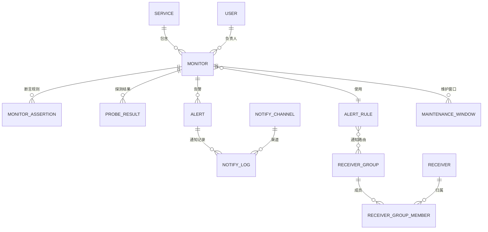

# 数据库设计

> 配套文档：`01-总体方案设计.md`
> 数据库：以 **MySQL 8.0 / PostgreSQL 14+** 为例（下方 DDL 以 MySQL 语法书写，PostgreSQL 可平滑迁移）。
> 历史探测明细数据量大，建议关系库只存**元数据 + 告警记录**，海量探测时间序列存入**时序库（VictoriaMetrics / Prometheus / InfluxDB）**或按月分表。

---

## 1. ER 关系总览



---

## 2. 表结构（DDL）

### 2.1 服务/业务线表 `service`

```sql
CREATE TABLE `service` (
  `id`          BIGINT       NOT NULL AUTO_INCREMENT COMMENT '主键',
  `name`        VARCHAR(128) NOT NULL COMMENT '服务/业务线名称',
  `code`        VARCHAR(64)  NOT NULL COMMENT '服务编码(唯一)',
  `type`        VARCHAR(32)  NOT NULL DEFAULT 'base' COMMENT 'saas/platform/base 基础服务',
  `owner_id`    BIGINT       NULL COMMENT '负责人(user.id)',
  `description` VARCHAR(512) NULL,
  `enabled`     TINYINT      NOT NULL DEFAULT 1,
  `created_at`  DATETIME     NOT NULL DEFAULT CURRENT_TIMESTAMP,
  `updated_at`  DATETIME     NOT NULL DEFAULT CURRENT_TIMESTAMP ON UPDATE CURRENT_TIMESTAMP,
  PRIMARY KEY (`id`),
  UNIQUE KEY `uk_code` (`code`)
) ENGINE=InnoDB DEFAULT CHARSET=utf8mb4 COMMENT='服务/业务线';
```

### 2.2 监控项表 `monitor`

```sql
CREATE TABLE `monitor` (
  `id`              BIGINT       NOT NULL AUTO_INCREMENT,
  `service_id`      BIGINT       NOT NULL COMMENT '所属服务',
  `name`            VARCHAR(128) NOT NULL COMMENT '监控项名称',
  `env`             VARCHAR(16)  NOT NULL DEFAULT 'prod' COMMENT 'prod/staging/test',
  `url`             VARCHAR(1024) NOT NULL COMMENT '目标接口URL',
  `method`          VARCHAR(8)   NOT NULL DEFAULT 'GET' COMMENT 'GET/POST/PUT...',
  `headers`         JSON         NULL COMMENT '请求头',
  `query_params`    JSON         NULL COMMENT 'Query参数',
  `body`            MEDIUMTEXT   NULL COMMENT '请求体',
  `body_type`       VARCHAR(32)  NULL COMMENT 'json/form/raw',
  `auth_type`       VARCHAR(32)  NOT NULL DEFAULT 'none' COMMENT 'none/basic/bearer/custom',
  `auth_config_id`  BIGINT       NULL COMMENT '认证配置(加密表)引用',
  `timeout_ms`      INT          NOT NULL DEFAULT 5000 COMMENT '超时(毫秒)',
  `interval_sec`    INT          NOT NULL DEFAULT 60 COMMENT '探测间隔(秒)',
  `retry_times`     INT          NOT NULL DEFAULT 2 COMMENT '单次任务内重试次数',
  `follow_redirect` TINYINT      NOT NULL DEFAULT 1,
  `verify_tls`      TINYINT      NOT NULL DEFAULT 1 COMMENT '是否校验证书',
  `probe_regions`   JSON         NULL COMMENT '探测点/地域列表',
  `alert_rule_id`   BIGINT       NULL COMMENT '关联告警规则',
  `owner_id`        BIGINT       NULL COMMENT '负责人',
  `status`          VARCHAR(16)  NOT NULL DEFAULT 'UP' COMMENT 'UP/PENDING/DOWN/RECOVERING',
  `enabled`         TINYINT      NOT NULL DEFAULT 1,
  `created_at`      DATETIME     NOT NULL DEFAULT CURRENT_TIMESTAMP,
  `updated_at`      DATETIME     NOT NULL DEFAULT CURRENT_TIMESTAMP ON UPDATE CURRENT_TIMESTAMP,
  PRIMARY KEY (`id`),
  KEY `idx_service` (`service_id`),
  KEY `idx_status` (`status`),
  KEY `idx_enabled_interval` (`enabled`, `interval_sec`)
) ENGINE=InnoDB DEFAULT CHARSET=utf8mb4 COMMENT='监控项';
```

### 2.3 监控断言规则表 `monitor_assertion`

一个监控项可以有多条断言，全部满足才算健康（可配置 AND/OR）。

```sql
CREATE TABLE `monitor_assertion` (
  `id`         BIGINT       NOT NULL AUTO_INCREMENT,
  `monitor_id` BIGINT       NOT NULL,
  `source`     VARCHAR(32)  NOT NULL COMMENT 'status_code/latency/body_json/body_regex/header',
  `expression` VARCHAR(256) NULL COMMENT 'JSONPath或Header名,如 $.code',
  `operator`   VARCHAR(16)  NOT NULL COMMENT 'eq/neq/in/lt/gt/contains/regex',
  `expected`   VARCHAR(512) NOT NULL COMMENT '期望值,如 200 / 0 / <800',
  `enabled`    TINYINT      NOT NULL DEFAULT 1,
  PRIMARY KEY (`id`),
  KEY `idx_monitor` (`monitor_id`)
) ENGINE=InnoDB DEFAULT CHARSET=utf8mb4 COMMENT='监控断言规则';
```

> 示例：状态码 `status_code eq 200`；业务码 `body_json($.code) eq 0`；性能 `latency lt 800`。

### 2.4 告警规则表 `alert_rule`

```sql
CREATE TABLE `alert_rule` (
  `id`                 BIGINT       NOT NULL AUTO_INCREMENT,
  `name`               VARCHAR(128) NOT NULL,
  `fail_threshold`     INT          NOT NULL DEFAULT 3 COMMENT '连续失败N次判定DOWN',
  `recover_threshold`  INT          NOT NULL DEFAULT 2 COMMENT '连续成功N次判定恢复',
  `severity`           VARCHAR(8)   NOT NULL DEFAULT 'P2' COMMENT 'P0/P1/P2/P3',
  `renotify_interval`  INT          NOT NULL DEFAULT 600 COMMENT '未恢复时再次通知间隔(秒)',
  `escalate_after`     INT          NULL COMMENT '升级阈值(秒),NULL不升级',
  `quorum`             VARCHAR(16)  NOT NULL DEFAULT 'any' COMMENT '多探测点判定: any/majority/all',
  `enabled`            TINYINT      NOT NULL DEFAULT 1,
  `created_at`         DATETIME     NOT NULL DEFAULT CURRENT_TIMESTAMP,
  PRIMARY KEY (`id`)
) ENGINE=InnoDB DEFAULT CHARSET=utf8mb4 COMMENT='告警规则';
```

### 2.5 探测结果表 `probe_result`（建议按月分表 / 或存时序库）

```sql
CREATE TABLE `probe_result` (
  `id`           BIGINT      NOT NULL AUTO_INCREMENT,
  `monitor_id`   BIGINT      NOT NULL,
  `region`       VARCHAR(32) NULL COMMENT '探测点',
  `success`      TINYINT     NOT NULL COMMENT '本次是否健康',
  `http_code`    INT         NULL,
  `latency_ms`   INT         NULL COMMENT '总耗时',
  `dns_ms`       INT         NULL,
  `connect_ms`   INT         NULL,
  `tls_ms`       INT         NULL,
  `ttfb_ms`      INT         NULL COMMENT '首字节时间',
  `error_type`   VARCHAR(32) NULL COMMENT 'timeout/dns/conn/tls/http/assert',
  `error_msg`    VARCHAR(512) NULL,
  `resp_snippet` VARCHAR(1024) NULL COMMENT '响应体片段(脱敏截断)',
  `probed_at`    DATETIME    NOT NULL,
  PRIMARY KEY (`id`),
  KEY `idx_monitor_time` (`monitor_id`, `probed_at`)
) ENGINE=InnoDB DEFAULT CHARSET=utf8mb4 COMMENT='探测结果明细';
```

### 2.6 告警记录表 `alert`

```sql
CREATE TABLE `alert` (
  `id`            BIGINT       NOT NULL AUTO_INCREMENT,
  `monitor_id`    BIGINT       NOT NULL,
  `service_id`    BIGINT       NOT NULL,
  `severity`      VARCHAR(8)   NOT NULL,
  `status`        VARCHAR(16)  NOT NULL DEFAULT 'firing' COMMENT 'firing/recovered/acked/silenced',
  `error_type`    VARCHAR(32)  NULL,
  `error_msg`     VARCHAR(512) NULL,
  `http_code`     INT          NULL,
  `fingerprint`   VARCHAR(64)  NOT NULL COMMENT '去重指纹(monitor+错误类型)',
  `first_seen`    DATETIME     NOT NULL COMMENT '故障首次发现',
  `last_seen`     DATETIME     NOT NULL COMMENT '最近一次发生',
  `recovered_at`  DATETIME     NULL COMMENT '恢复时间',
  `duration_sec`  INT          NULL COMMENT '故障持续秒数',
  `notify_count`  INT          NOT NULL DEFAULT 0,
  `acked_by`      BIGINT       NULL,
  `acked_at`      DATETIME     NULL,
  `remark`        VARCHAR(512) NULL,
  `created_at`    DATETIME     NOT NULL DEFAULT CURRENT_TIMESTAMP,
  PRIMARY KEY (`id`),
  KEY `idx_monitor` (`monitor_id`),
  KEY `idx_status` (`status`),
  KEY `idx_fingerprint` (`fingerprint`)
) ENGINE=InnoDB DEFAULT CHARSET=utf8mb4 COMMENT='告警记录';
```

### 2.7 通知渠道表 `notify_channel`（敏感字段加密存储）

```sql
CREATE TABLE `notify_channel` (
  `id`         BIGINT       NOT NULL AUTO_INCREMENT,
  `name`       VARCHAR(128) NOT NULL,
  `type`       VARCHAR(32)  NOT NULL COMMENT 'email/wecom_robot/wecom_app',
  `config`     JSON         NOT NULL COMMENT '渠道配置(敏感值加密): smtp/webhook/corpid等',
  `enabled`    TINYINT      NOT NULL DEFAULT 1,
  `created_at` DATETIME     NOT NULL DEFAULT CURRENT_TIMESTAMP,
  PRIMARY KEY (`id`)
) ENGINE=InnoDB DEFAULT CHARSET=utf8mb4 COMMENT='通知渠道配置';
```

> `config` 示例：
> - email：`{"host":"smtp.exmail.qq.com","port":465,"tls":"ssl","username":"...","password":"<enc>","from":"API监控"}`
> - wecom_robot：`{"webhook":"https://qyapi.weixin.qq.com/cgi-bin/webhook/send?key=<enc>"}`
> - wecom_app：`{"corpid":"...","agentid":1000002,"secret":"<enc>"}`

### 2.8 接收人 / 接收组

```sql
CREATE TABLE `receiver` (
  `id`           BIGINT       NOT NULL AUTO_INCREMENT,
  `name`         VARCHAR(64)  NOT NULL,
  `email`        VARCHAR(128) NULL,
  `wecom_userid` VARCHAR(64)  NULL,
  `mobile`       VARCHAR(20)  NULL,
  `enabled`      TINYINT      NOT NULL DEFAULT 1,
  PRIMARY KEY (`id`)
) ENGINE=InnoDB DEFAULT CHARSET=utf8mb4 COMMENT='接收人';

CREATE TABLE `receiver_group` (
  `id`   BIGINT       NOT NULL AUTO_INCREMENT,
  `name` VARCHAR(64)  NOT NULL,
  PRIMARY KEY (`id`)
) ENGINE=InnoDB DEFAULT CHARSET=utf8mb4 COMMENT='接收组';

CREATE TABLE `receiver_group_member` (
  `group_id`    BIGINT NOT NULL,
  `receiver_id` BIGINT NOT NULL,
  PRIMARY KEY (`group_id`, `receiver_id`)
) ENGINE=InnoDB DEFAULT CHARSET=utf8mb4 COMMENT='接收组成员';
```

### 2.9 通知路由策略表 `notify_policy`

```sql
CREATE TABLE `notify_policy` (
  `id`            BIGINT      NOT NULL AUTO_INCREMENT,
  `scope_type`    VARCHAR(16) NOT NULL COMMENT 'global/service/monitor',
  `scope_id`      BIGINT      NULL COMMENT '对应service_id或monitor_id',
  `severity`      VARCHAR(8)  NOT NULL COMMENT '匹配的告警等级',
  `group_id`      BIGINT      NOT NULL COMMENT '通知接收组',
  `channel_ids`   JSON        NOT NULL COMMENT '使用的渠道ID列表',
  `is_escalation` TINYINT     NOT NULL DEFAULT 0 COMMENT '是否为升级策略',
  `enabled`       TINYINT     NOT NULL DEFAULT 1,
  PRIMARY KEY (`id`),
  KEY `idx_scope` (`scope_type`, `scope_id`)
) ENGINE=InnoDB DEFAULT CHARSET=utf8mb4 COMMENT='通知路由策略';
```

### 2.10 通知发送记录表 `notify_log`

```sql
CREATE TABLE `notify_log` (
  `id`          BIGINT       NOT NULL AUTO_INCREMENT,
  `alert_id`    BIGINT       NOT NULL,
  `channel_id`  BIGINT       NOT NULL,
  `channel_type` VARCHAR(32) NOT NULL,
  `receiver`    VARCHAR(256) NULL COMMENT '接收人(邮箱/userid)',
  `content`     MEDIUMTEXT   NULL,
  `success`     TINYINT      NOT NULL,
  `error_msg`   VARCHAR(512) NULL,
  `cost_ms`     INT          NULL,
  `retry_count` INT          NOT NULL DEFAULT 0,
  `sent_at`     DATETIME     NOT NULL DEFAULT CURRENT_TIMESTAMP,
  PRIMARY KEY (`id`),
  KEY `idx_alert` (`alert_id`),
  KEY `idx_sent_at` (`sent_at`)
) ENGINE=InnoDB DEFAULT CHARSET=utf8mb4 COMMENT='通知发送回执';
```

### 2.11 维护窗口/静默表 `maintenance_window`

```sql
CREATE TABLE `maintenance_window` (
  `id`         BIGINT       NOT NULL AUTO_INCREMENT,
  `name`       VARCHAR(128) NOT NULL,
  `scope_type` VARCHAR(16)  NOT NULL COMMENT 'global/service/monitor',
  `scope_id`   BIGINT       NULL,
  `start_at`   DATETIME     NOT NULL,
  `end_at`     DATETIME     NOT NULL,
  `reason`     VARCHAR(256) NULL,
  `created_by` BIGINT       NULL,
  `created_at` DATETIME     NOT NULL DEFAULT CURRENT_TIMESTAMP,
  PRIMARY KEY (`id`),
  KEY `idx_time` (`start_at`, `end_at`)
) ENGINE=InnoDB DEFAULT CHARSET=utf8mb4 COMMENT='维护窗口/静默';
```

### 2.12 用户与权限（RBAC）

```sql
CREATE TABLE `user` (
  `id`         BIGINT       NOT NULL AUTO_INCREMENT,
  `username`   VARCHAR(64)  NOT NULL,
  `password`   VARCHAR(128) NOT NULL COMMENT '加盐哈希',
  `real_name`  VARCHAR(64)  NULL,
  `email`      VARCHAR(128) NULL,
  `role`       VARCHAR(16)  NOT NULL DEFAULT 'viewer' COMMENT 'admin/ops/viewer',
  `enabled`    TINYINT      NOT NULL DEFAULT 1,
  `created_at` DATETIME     NOT NULL DEFAULT CURRENT_TIMESTAMP,
  PRIMARY KEY (`id`),
  UNIQUE KEY `uk_username` (`username`)
) ENGINE=InnoDB DEFAULT CHARSET=utf8mb4 COMMENT='用户';
```

---

## 3. 数据保留与归档策略

| 数据 | 保留策略 |
| --- | --- |
| `probe_result` 探测明细 | 关系库保留 7~15 天；长期趋势进时序库（聚合后存 90 天+）|
| `alert` 告警记录 | 长期保留（如 1 年）用于复盘 |
| `notify_log` 通知回执 | 保留 90 天 |
| 聚合指标（可用率/SLA/P95） | 按天/小时预聚合，长期保留 |

建议对 `probe_result` 按月分表（`probe_result_202606`）或使用时序库，避免单表膨胀影响性能。
