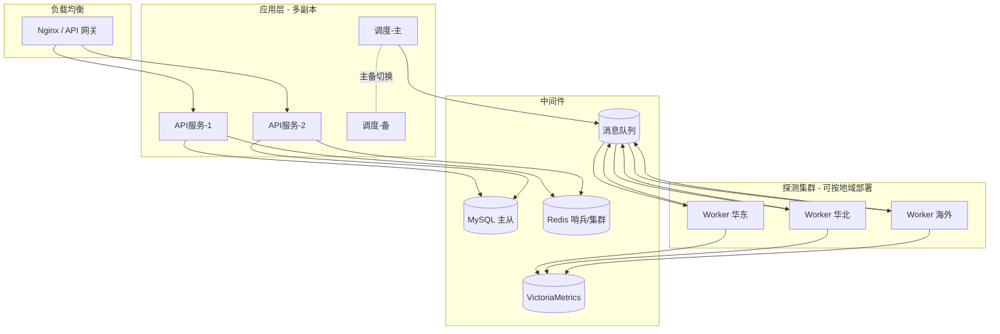
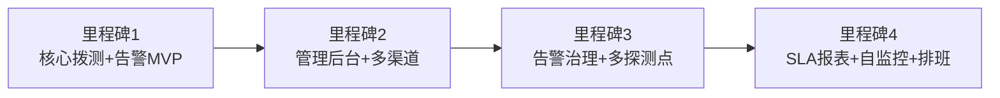

# 技术选型、部署、安全与实施路线图

> 配套文档：`01-总体方案设计.md`

---

## 1. 技术选型

技术栈非强制，给出两套常见组合，可按团队熟悉度选择。

### 方案 A：Java 技术栈（推荐用于已有 Java 体系的公司）

| 层 | 选型 | 说明 |
| --- | --- | --- |
| 后端框架 | Spring Boot 3 | 成熟、生态完善 |
| 定时调度 | XXL-JOB / ElasticJob | 分布式任务调度，支持分片 |
| 探测 HTTP 客户端 | OkHttp / WebClient | 支持连接池、超时、指标采集 |
| 消息队列 | RabbitMQ / Kafka | 任务/事件削峰解耦 |
| 关系库 | MySQL 8 / PostgreSQL | 元数据 + 告警记录 |
| 缓存/状态 | Redis | access_token、状态机、限流、分布式锁 |
| 时序库 | VictoriaMetrics / Prometheus | 探测指标、SLA 趋势 |
| 前端 | Vue3 + Element Plus / React + Antd | 管理后台 |

### 方案 B：Go 技术栈（推荐用于高并发、轻量部署）

| 层 | 选型 |
| --- | --- |
| 后端框架 | Gin / Kratos / go-zero |
| 调度 | robfig/cron + Redis 分布式锁 / Asynq |
| 任务队列 | Asynq（基于 Redis）/ NATS / Kafka |
| 探测 | net/http + 自定义 Transport |
| 其余 | MySQL/PostgreSQL + Redis + VictoriaMetrics |

### 是否「自研 vs 复用开源」

如希望**快速落地**，可基于成熟开源拨测/告警系统二次开发，再叠加企业微信通知：

- **Uptime Kuma**：轻量、自带界面，支持 HTTP/关键字监控与多种通知（含企业微信），适合中小规模快速起步。
- **Prometheus Blackbox Exporter + Alertmanager**：标准黑盒拨测 + 告警路由，Alertmanager 通过 webhook 转企业微信。
- **Grafana + Synthetic Monitoring**：可视化强。

> 建议：**先用开源（如 Blackbox Exporter + Alertmanager + 自研企业微信 webhook 适配器）快速验证**，待规模与定制需求上来后，再迁移到本方案的自研架构。本设计文档兼容这两条路径。

---

## 2. 部署架构

部署要点：
- **应用与调度多副本**，调度通过分布式锁保证单活（主备）。
- **Worker 按地域多点部署**，实现多点拨测，降低网络误报、支持就近探测内网/公网接口。
- 容器化部署（Docker + Kubernetes），HPA 按队列积压自动扩缩 Worker。
- 中间件采用高可用配置（MySQL 主从、Redis 哨兵/集群、MQ 集群）。

---

## 3. 安全设计

| 方面 | 措施 |
| --- | --- |
| 敏感配置加密 | SMTP 密码、企业微信 secret/webhook key、接口 Token 使用 AES/KMS 加密存储，密钥由 KMS/Vault 托管 |
| 传输安全 | 后台与 API 全 HTTPS；探测可校验目标 TLS 证书有效期（可作为额外监控项）|
| 访问控制 | 后台 RBAC（admin/ops/viewer），操作审计日志 |
| 响应体脱敏 | 探测响应体仅截断保存片段，按规则脱敏（手机号/身份证/token）|
| 最小权限 | 监控账号对被监控接口仅用只读/健康检查类接口，避免触发写操作 |
| 防滥用 | 探测频率限制，避免对目标接口造成压力；对内部接口走白名单 |
| 审计 | 监控项变更、静默操作、通知配置变更全程留痕 |

---

## 4. 监控系统自监控（避免「监控自己挂了没人知道」）

- **心跳上报 / Dead Man's Switch**：调度中心定期向外部独立看门狗（如 Healthchecks.io 或自建）上报心跳，超时未上报则由独立渠道告警。
- **组件自监控**：API 服务、Worker、队列积压、数据库连接数纳入 Prometheus 监控。
- **通知渠道连通性自检**：定期发送测试消息验证 SMTP / 企业微信可用。

---

## 5. 实施路线图（按里程碑，非时间）

**里程碑 1（MVP，最小可用）**
- 监控项 CRUD（数据库 + 基础 API）。
- 调度 + HTTP 探测 + 状态码/超时判定。
- 状态机 + 连续失败告警。
- 企业微信群机器人 + 邮件通知。

**里程碑 2（可管理）**
- Web 管理后台（监控项、告警记录、渠道配置）。
- 断言规则（JSONPath/正则/响应时间）。
- 企业微信应用消息（精准到人/部门）。
- 通知路由策略、接收人/组。

**里程碑 3（告警治理）**
- 去重/收敛/抑制/静默/维护窗口。
- 告警升级与值班排班。
- 多探测点 / 多地域确认。

**里程碑 4（成熟运营）**
- SLA / 可用率报表、响应时间趋势大盘（时序库）。
- 系统自监控、Dead Man's Switch。
- OpenAPI 批量导入监控项、与 CI/CD 联动自动静默。

---

## 6. 验收与关键指标

| 指标 | 目标 |
| --- | --- |
| 故障发现时延 | 接口故障到产生告警 < 1~2 个探测周期 |
| 通知到达时延 | 告警产生到运维收到通知 < 30s |
| 误报率 | 通过重试 + 多点确认控制在低水平 |
| 监控系统可用性 | 自身 SLA ≥ 99.9% |
| 单实例探测能力 | 单 Worker 支撑 N 千接口/分钟（按选型压测确定）|

---

## 7. 后续可扩展方向

- 更多通知渠道：短信、钉钉、飞书、电话语音（PagerDuty 风格）。
- 拨测类型扩展：TCP/Ping/DNS/SSL 证书到期、多步骤业务流程拨测（登录→下单→查询）。
- 智能告警：基于历史基线的动态阈值、异常检测，减少静态阈值误报。
- 与 APM/链路追踪联动：告警直接关联 Trace，加速定位根因。
