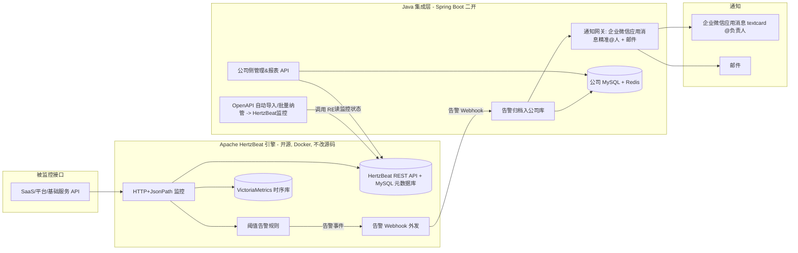

# MVP 开发提示词（AI 编码代理用）— 基于 Apache HertzBeat 二次开发

> 配套文档：`01-总体方案设计.md` ~ `05-API接口设计.md`、`04-技术选型与部署.md`（选型结论）
> 用途：一组**可直接喂给 AI 编码代理**（如 Cursor / Claude）的结构化提示词，用于实现 MVP。
> 方向（已确定）：复用开源 **[Apache HertzBeat](https://github.com/apache/hertzbeat)** 作为监控/探测/告警/通知引擎，
> 在其之上用 **Java 17 + Spring Boot 3** 做「二次开发集成层」，承接公司定制：批量纳管接口、统一数据归档与报表、与内部系统打通。

---

## 0. 方向说明：HertzBeat 怎么二次开发

> 先读懂边界再开发。

- **HertzBeat 本身就是 Java + Spring Boot（Apache 2.0）**，与公司技术栈一致，开箱即覆盖大部分需求：
  - **API 接口监控**：HTTP + JsonPath，支持多步骤（先取 token 再调业务接口）、SSL 证书到期、阈值表达式告警。
  - **原生通知**：邮件、企业微信、钉钉、飞书、短信、Webhook；接收人管理 + 通知策略（按标签/级别路由）。
  - **告警治理**：阈值规则、分组、收敛、静默、抑制。
  - **数据库**：元数据库（MySQL/PostgreSQL）+ 时序库（VictoriaMetrics/IoTDB/TDengine/GreptimeDB，PoC 可用内置）。
  - 自带 Web UI，提供 REST API（带 Swagger/Knife4j），可编程化管理监控项。

- **二次开发的两条路径**（本提示词采用「路径 B」为主）：
  - 路径 A（直接改源码 / Fork）：把公司功能直接加进 HertzBeat 仓库。优点是深度定制；缺点是要跟随上游升级、维护 Fork 成本高。**适合后期有重度定制时再做。**
  - **路径 B（旁挂集成层，推荐 MVP）**：HertzBeat 以官方镜像部署、不改源码；另写一个轻量 **Java 集成服务**，通过 HertzBeat **REST API** 完成「批量纳管接口、同步公司服务清单、统一告警归档/报表、SSO 等」。耦合低、可演进，后续若需深度定制再转路径 A。

### 架构示意（路径 B）



---

## 1. MVP 范围界定

**In Scope（本期做）**：
- 用 Docker 部署 HertzBeat，**时序库采用 VictoriaMetrics**（历史趋势/SLA），元数据库用 MySQL。
- 在 HertzBeat 中配置：HTTP API 监控（含 JsonPath 业务码校验）、阈值告警规则、通知与通知策略。
- **企业微信通知做到精准@人**：用企业微信**自建应用消息（textcard）**按服务/负责人 touser 精准推送，外加邮件。
- **Java 集成层（Spring Boot）**：
  - **OpenAPI 自动导入**：解析 OpenAPI/Swagger 文档（v3，兼容 v2），自动生成监控项并通过 HertzBeat REST API **批量纳管**；也支持公司接口清单 JSON 导入。
  - 接收 HertzBeat 告警 **Webhook**，把告警与通知结果**归档到公司 MySQL**，提供查询/报表 API。
  - 通知网关：企业微信应用消息（精准@人）+ 邮件，公司模板与按服务路由。
  - 简单统计概览（当前告警数、按服务分布）。
- 一体化 `docker-compose`：HertzBeat + MySQL + VictoriaMetrics + Java 集成层。

**Out of Scope（后续里程碑）**：
- 直接 Fork HertzBeat 源码做深度定制（路径 A）。
- SSO/与发布系统联动自动静默、值班排班、告警升级电话。
- 公司自研管理前端（MVP 先用 HertzBeat 自带 UI + 集成层 Swagger）。
- OpenAPI 的复杂鉴权流自动推断（MVP 仅导入基础请求，鉴权按模板/默认值，复杂场景人工微调）。

---

## 2. 技术栈与全局约束（每阶段附带的公共上下文）

```text
【公共上下文 / 请在每个阶段开头附带】

我们做「API 监控告警系统」MVP，方向：复用开源 Apache HertzBeat 作监控/告警/通知引擎，
再用 Java 写一个旁挂的集成层（通过 HertzBeat REST API 与 告警 Webhook 集成，不改 HertzBeat 源码）。请遵守：

- 监控引擎：Apache HertzBeat（最新稳定版，Docker 部署，Apache 2.0），时序库用 VictoriaMetrics。
- 集成层语言/框架：Java 17+（开发环境实际用 JDK 21 亦可），Spring Boot 3.2.x，Maven。
- 持久层：MyBatis-Plus 3.5.x + MySQL 8.0；迁移用 Flyway。
- 缓存：Redis（缓存企业微信 access_token），spring-boot-starter-data-redis。
- HTTP 客户端：OkHttp 4.x（调用 HertzBeat REST API、企业微信 API）。
- 邮件：spring-boot-starter-mail。
- OpenAPI 解析：io.swagger.parser.v3:swagger-parser（兼容 OpenAPI v3 / Swagger v2）。
- JSON：Jackson；JsonPath 用 com.jayway.jsonpath:json-path（解析 HertzBeat 告警 webhook）。
- API 文档：springdoc-openapi（Swagger UI）。
- 配置：application.yml，敏感值（HertzBeat 账号、Webhook 校验密钥）从环境变量注入，禁止硬编码明文，日志脱敏。
- 全开源，禁止收费/闭源依赖。
- 分层清晰：controller/service/mapper/entity/dto/config/client(HertzBeat客户端)/webhook/common；
  统一返回体 Result<T>{code,message,data}；统一异常处理；关键路径日志。
- 与 HertzBeat 交互前，先读取其部署版本的 API 文档（Swagger/Knife4j，通常在 /swagger-ui 或 /doc.html），
  以实际接口路径与字段为准，不要臆造接口；登录态用其鉴权接口拿 token 后带 Bearer 调用。
- 注释克制；每阶段产出后给出：改动文件清单 + 本地验证步骤；完成后停下等我确认再继续。
```

---

## 3. 阶段 0：部署 HertzBeat（监控引擎）

```text
【阶段0 提示词】（附带第2节公共上下文）

任务：用 Docker 部署 Apache HertzBeat，并完成可访问、可持久化的基础环境（产出部署配置与说明，不写 Java）。

要求：
1. 产出 deploy/hertzbeat/docker-compose.yml：
   - 服务 hertzbeat，镜像 apache/hertzbeat:<最新稳定 tag>，暴露 1157(Web/API)、可选 1158(集群)。
   - 元数据库用 MySQL 8：配置 HertzBeat 连接外部 MySQL（参考官方环境变量/配置）。
   - **时序库采用 VictoriaMetrics**：加 victoria-metrics 服务（暴露 8428），并配置 HertzBeat 的
     warehouse 指向它（HertzBeat 配置 warehouse.store.victoria-metrics.enabled=true、url/账号）。
   - 数据卷持久化；服务健康检查。
2. 产出 deploy/hertzbeat/README.md：
   - 启动步骤、默认账号(admin/hertzbeat)及首次改密。
   - Web 控制台地址、API 文档地址(Swagger/Knife4j)。
   - 连接外部 MySQL / VictoriaMetrics 的配置说明（给出实际配置项）。
   - 验证 VictoriaMetrics 已生效：监控产生的指标能在历史图表/趋势查询中看到。
3. 不修改 HertzBeat 源码。

产出：可一键启动、可登录 Web、API 文档可访问、数据可持久化的 HertzBeat 环境。
```

---

## 4. 阶段 1：在 HertzBeat 配置 API 接口监控

```text
【阶段1 提示词】（附带公共上下文）

任务：在 HertzBeat 中配置 HTTP API 监控并验证（以操作文档 + 可复用监控模板形式产出，不写 Java）。

时效性与分级采集（重要，参考 docs/01 第5节）：
- 按接口重要性分级设置采集间隔与确认次数，平衡「发现时效」与「误报/成本」：
  - P0 核心(支付/登录/网关)：间隔 30s、连续确认 1 次、超时 5s（目标首次告警约 30~40s）。
  - P1/P2 重要：间隔 60s、连续确认 2 次、超时 5~10s（约 1~2 分钟）。
  - P3 一般/易抖动：间隔 60~120s、连续确认 3 次、超时 10s（约 3~5 分钟）。
- 采集器若任务积压会拉长实际间隔，监控项多时需扩采集器集群。

要求（产出 deploy/hertzbeat/monitors/README.md）：
1. 新增「网站监控 / HTTP API」监控：填写 URL、请求方式、Header、按上面分级设置采集间隔/超时、期望状态码、连续触发次数。
2. 用 HTTP + JsonPath 校验响应体业务码：示例对 {"code":0,...} 配置 JsonPath $.code 提取并设阈值（code != 0 触发告警）。
3. 多步骤认证示例：用 priority 先请求登录/取 token 接口，提取 token 注入后续业务接口请求头（给出配置说明）。
4. SSL 证书到期监控：对 https 接口配置证书到期天数监控（剩余天数 < N 告警）。
5. 阈值告警规则：演示「响应码异常」「响应时间过高」「业务码非0」「证书将到期」的告警规则配置（含告警级别 critical/warning）。
6. 如需复用，导出/编写自定义监控模板 YML（参考 HertzBeat app-api.yml），放 deploy/hertzbeat/monitors/。

产出：HertzBeat 中已存在可用的 API 监控项与告警规则，可手动触发并在 HertzBeat 看到告警。
```

---

## 5. 阶段 2：配置企业微信 + 邮件通知与通知策略

```text
【阶段2 提示词】（附带公共上下文）

任务：在 HertzBeat 中配置邮件与企业微信通知、接收人与通知策略（操作文档，不写 Java）。

要求（产出 deploy/hertzbeat/notify/README.md）：
1. 配置邮件服务器(SMTP)：host/port/加密/发件账号/授权码（敏感值通过环境变量或安全方式录入）。
2. 新增接收人：
   - 邮件接收人。
   - **企业微信应用消息（精准@人，MVP 必做）**：配置企业微信自建应用 corpid/agentid/secret，
     接收人填企业微信 userid，实现按服务/负责人 touser 精准推送（textcard 卡片，可点击跳详情）。
   - （可选兜底）企业微信群机器人 Webhook。
3. 配置通知策略：把「哪些标签/级别的告警」分派给「哪些接收人/渠道」。
   - 示例：critical → 核心运维组（企业微信应用消息精准@负责人 + 邮件）；warning → 普通运维组。
   - 标签约定：导入监控项时打 service/owner 标签，供通知策略按服务路由到对应负责人。
4. 通知模板：按公司话术自定义告警/恢复模板（服务名、接口、错误、时间、详情链接）。
5. 验证：触发一次告警，确认对应负责人（@到人）的企业微信与邮件都能收到；恢复后能收到恢复通知。

说明：HertzBeat 原生通知可覆盖一部分；若需更强的「按服务→负责人」精准路由与公司统一模板，
由 Java 集成层的通知网关接管（见阶段5），HertzBeat 侧通过 Webhook 把告警转给集成层。

产出：HertzBeat 告警可经企业微信应用消息（精准@人）+ 邮件按策略送达对应负责人。
```

---

## 6. 阶段 3：Java 集成层脚手架 + HertzBeat API 客户端

```text
【阶段3 提示词】（附带公共上下文）

任务：初始化 Spring Boot 集成层工程，并封装 HertzBeat REST API 客户端。

要求：
1. groupId=com.company.monitor，artifactId=monitor-integration，Java 17。
2. 依赖：starter-web、validation、starter-mail、starter-data-redis、mybatis-plus-spring-boot3-starter、
   mysql-connector-j、flyway-core+flyway-mysql、okhttp、json-path、swagger-parser(v3)、lombok、hutool-all、springdoc-openapi。
3. application.yml：数据源(环境变量)、Redis、MyBatis-Plus、Flyway、自定义段 hertzbeat.*(base-url/username/password)、
   wecom.*(corpid/agentid/secret/default-userids)、mail.*、integration.*(webhook-token、detail-base-url)。
4. 包结构 + 统一返回体 Result<T> + 全局异常 + /health + Swagger。
5. HertzBeatClient（用 OkHttp）：
   - login()：调用 HertzBeat 鉴权接口获取 token（按部署版本实际接口为准），缓存并自动续期/失效重登。
   - 封装监控项相关接口：列表查询、按条件查询、新增、修改、删除、启停（以实际 API 文档为准，先读 Swagger 再实现）。
   - 统一错误处理与重试；token 失效自动重新登录重试一次。
6. 提供 GET /api/v1/hertzbeat/monitors 透传查询，验证客户端连通。

产出：集成层可成功登录 HertzBeat 并拉取监控列表。
```

---

## 7. 阶段 4：批量纳管公司接口清单

```text
【阶段4 提示词】（附带公共上下文）

任务：实现把公司 API 清单批量同步为 HertzBeat 监控项，并在公司库登记映射关系。

1. Flyway 建表 V1__init.sql（utf8mb4，字段加 COMMENT）：
   - monitor_ref：id, hzb_monitor_id(HertzBeat监控ID), name, url, service_name, env, severity,
     enabled, synced_at, created_at, updated_at；唯一键(service_name+name) 或 url 用于幂等。
   - 生成实体/Mapper。
2. **OpenAPI 自动导入（MVP 重点）** POST /api/v1/provision/import-openapi：
   - 入参：OpenAPI/Swagger 文档（支持上传 JSON/YAML、或传 URL 由集成层拉取）。用成熟开源解析库
     （如 io.swagger.parser.v3:swagger-parser，兼容 OpenAPI v3 与 Swagger v2）解析。
   - 遍历 paths × methods，每个操作映射为一个 HertzBeat 监控项：
     - URL = servers/basePath + path（路径参数用默认值/示例值占位，缺失则用占位符并标记需人工确认）。
     - method、必要 header（如 Content-Type）、按 requestBody example 生成最简 body。
     - 期望状态码默认 2xx；如 responses 定义了成功码则采用。
     - service_name 取自 OpenAPI info.title 或用户指定；severity 默认 P2，可在入参覆盖。
     - 采集间隔/超时按分级默认（参考阶段1/ docs/01 第5节），可入参覆盖。
   - 导入前返回「预览」（将创建/更新的监控项清单），确认后再实际写入（或入参 dryRun 控制）。
   - 鉴权占位：OpenAPI 的 securitySchemes 仅记录提示，复杂鉴权流人工微调（见 Out of Scope）。
   - 调用 HertzBeatClient 批量创建/更新（已存在按幂等键 service+path+method 更新），回填 monitor_ref。
   - 健壮性：单条失败不阻断整体；返回成功/失败/跳过明细与原因。
3. 兼容入口 POST /api/v1/provision/import：接收公司接口清单 JSON 数组
   （name/url/method/headers/interval/期望状态码/JsonPath断言/service_name/severity），同样批量纳管。
4. GET /api/v1/monitors：查询本地 monitor_ref（分页/过滤）；PUT 维护 service_name/severity/owner 等业务属性。

产出：上传一份 OpenAPI 文档即可在 HertzBeat 批量生成监控项；公司库可查映射与同步状态。
```

---

## 8. 阶段 5：告警归档 + 企业微信应用消息(精准@人) + 报表

```text
【阶段5 提示词】（附带公共上下文）

任务：接收 HertzBeat 告警 → 归档公司库 → 经企业微信应用消息(精准@负责人)+邮件按公司模板通知 → 提供查询/统计 API。

1. 在 HertzBeat 配置一个「Webhook」通知，指向集成层 /api/v1/webhook/hertzbeat（阶段2可一并配置）。
2. Flyway V2 建表：
   - alert：id, hzb_monitor_id, monitor_name, url, service_name, severity, status(firing/recovered),
     content, target, trigger_times, first_seen, last_seen, recovered_at, duration_sec, created_at；
     索引(hzb_monitor_id)、(status)、(service_name, created_at)。
   - notify_log：id, alert_id, channel_type(wecom_app/email), receiver, content, success,
     error_msg, cost_ms, retry_count, sent_at。
   - service_owner（服务→负责人映射）：id, service_name, wecom_userids(逗号分隔), email_list, enabled。
3. POST /api/v1/webhook/hertzbeat：
   - 兼容解析 HertzBeat 告警 webhook payload（以实际字段为准，用 JsonPath/DTO 容错解析）。
   - 区分告警/恢复；按 hzb_monitor_id 维护 firing/recovered 状态、duration_sec。
   - 用 header 共享密钥(X-Webhook-Token)校验来源；异常记录日志但返回200，避免重推干扰。
   - 关联 monitor_ref 补充 service_name/severity；触发通知网关。
4. 通知网关 + 渠道：
   - TemplateRenderer：告警/恢复两套模板（服务、接口、错误、时间、持续时长、详情链接），文本+企业微信 textcard。
   - WecomAppChannel（企业微信自建应用，精准@人，MVP 必做）：
     - 用 corpid/agentid/secret 获取 access_token，**用 Redis 缓存**（key 区分 agentid，过期前刷新）；
       errcode 42001/40014 时刷新重试一次。
     - 按 alert.service_name 在 service_owner 查到 wecom_userids，作为 touser，发送 textcard（可点击跳详情）。
       查不到负责人则回退到默认接收人（配置）。
   - EmailChannel：JavaMailSender 发 HTML 邮件，收件人取 service_owner.email_list，失败指数退避重试 3 次。
   - 每次发送写 notify_log；敏感配置(secret/密码)从环境变量读取并在日志脱敏。
5. 查询/统计 API：
   - GET /api/v1/alerts（分页，按 status/severity/service/时间过滤）、GET /api/v1/alerts/{id}（含 notify_log）。
   - GET /api/v1/stats/overview（当前 firing 数、今日告警数、按服务分布）。
   - GET/POST/PUT /api/v1/service-owners（维护服务→负责人映射）。

产出：HertzBeat 告警实时归档到公司 MySQL；对应服务负责人在企业微信被精准@到 + 收到邮件；可通过 API 查询与做基础报表。
```

---

## 9. 阶段 6：一体化部署与端到端联调

```text
【阶段6 提示词】（附带公共上下文）

任务：一体化部署、端到端联调、文档与健壮性。

要求：
1. 顶层 docker-compose.yml：hertzbeat + mysql(元数据/公司库可分库) + (可选 victoria-metrics) + monitor-integration(Java)，
   网络互通：集成层能访问 HertzBeat API；HertzBeat Webhook 指向集成层服务名:8080。
2. 完善 README：环境变量清单、启动顺序、Web/API/Swagger 地址、
   「批量导入接口 → HertzBeat 生成监控 → 触发告警 → 企业微信+邮件送达 → 告警归档可在 API 查询」的完整流程。
3. 单元测试：HertzBeat 告警 payload 解析、provision 字段映射、告警 firing/recovered 状态流转。
4. 健壮性：HertzBeat 不可用时集成层降级与重试；Webhook 异常返回200并记录；通知不影响归档入库。
5. 自检清单写入 README：
   - [ ] 批量导入接口 → HertzBeat 出现对应监控项
   - [ ] 接口异常 → 企业微信 + 邮件按策略收到告警
   - [ ] 接口恢复 → 收到恢复通知
   - [ ] 集成层 /api/v1/alerts 能查到归档告警与统计
   - [ ] HertzBeat UI 与公司库数据一致

产出：可本地一键起全栈并完成端到端验证的 MVP。
```

---

## 10. 给 AI 代理的「总控提示词」

```text
你是一名资深 Java 后端工程师。我们采用「复用开源 Apache HertzBeat 作监控/告警/通知引擎 +
旁挂一个 Java(Spring Boot) 集成层」的方式实现 API 监控告警系统 MVP。
HertzBeat 用 Docker 部署、不改源码；集成层用 Java 17 + Spring Boot 3 + MyBatis-Plus + MySQL + Flyway + OkHttp，全部开源。
集成方式：通过 HertzBeat REST API（批量纳管监控项）与 告警 Webhook（告警归档）对接。
请严格按我给出的「阶段X 提示词」逐步实现；与 HertzBeat 交互前务必先读其部署版本的 API 文档(Swagger/Knife4j)，
以实际接口为准，不要臆造接口。每阶段结束输出：改动文件清单 + 本地验证步骤，然后停下等我确认再继续。
不要提前实现超范围功能；不引入收费/闭源依赖；注释克制；遇取舍优先简单可演进方案并说明理由。
```

---

## 11. 使用建议

1. 先发「第 10 节总控提示词」，再依次发「阶段 0 → 阶段 6」，每阶段附「第 2 节公共上下文」。
2. 阶段 0~2 主要是 HertzBeat 部署与配置（很多需求开箱即得）；阶段 3~5 才是 Java 二次开发。
3. 准备好：企业微信群机器人 Webhook（或自建应用 corpid/agentid/secret）、企业邮箱 SMTP 授权码、HertzBeat 管理员账号。
4. 与 HertzBeat 的 REST API/Webhook 字段，**以你部署版本的实际 API 文档为准**（不同版本略有差异），提示词已要求 AI 先读 Swagger 再实现。
5. 若后续需要深度定制（如自定义采集协议、改 UI、嵌入公司 SSO 到引擎内），再评估从「路径 B 旁挂」升级为「路径 A Fork 源码」。
