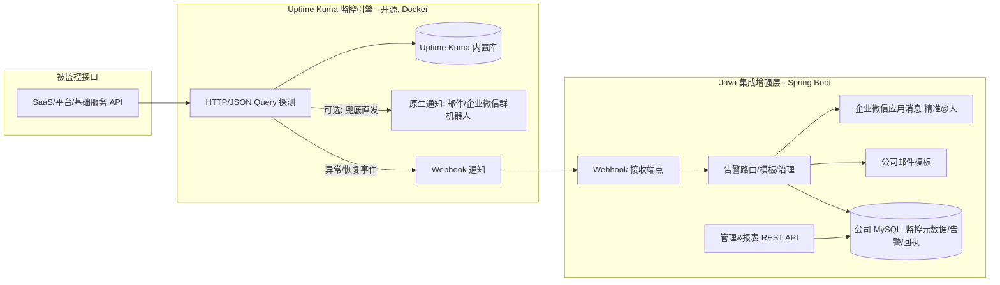

# MVP 开发提示词（AI 编码代理用）— 基于 Uptime Kuma 二次开发

> 配套文档：`01-总体方案设计.md` ~ `05-API接口设计.md`
> 用途：一组**可直接喂给 AI 编码代理**（如 Cursor / Claude）的结构化提示词，用于实现 MVP。
> 方向（已确定）：**复用开源监控系统 [Uptime Kuma](https://github.com/louislam/uptime-kuma) 作为监控/探测/原生通知引擎**，
> 在其之上用 **Java 17 + Spring Boot 3** 开发「集成增强层」，满足公司「数据库统一管理 + 企业微信精准通知 + 告警记录/报表」需求。

---

## 0. 为什么是「Uptime Kuma + Java 集成层」而不是直接改内核

> 这一节是方向决策说明，请先读懂再开发。

- **Uptime Kuma 是 Node.js(后端) + Vue(前端)** 项目（MIT 协议，截至 2026-06 最新 v2.4.0）。直接改它的内核 = 写 JS/Vue，**与公司 Java 技术栈不一致**，长期维护成本高。
- Uptime Kuma **开箱即用的能力已覆盖大部分核心需求**：
  - 监控类型：**HTTP(s) / HTTP(s) Keyword / HTTP(s) JSON Query / TCP / DNS / 证书到期** 等 —— 满足「API 接口级监控、状态码、关键字、JSON 字段断言」。
  - 重试 + 心跳间隔（最低 20s）+ 上/下线状态判定 —— 满足「防瞬时抖动」。
  - 通知渠道 90+，**原生支持 Email(SMTP) 与 企业微信(WeCom) 群机器人** —— 满足「邮件 + 企业微信」最低要求。
- **Uptime Kuma 不擅长 / 公司额外需要的**（→ 由 Java 集成层补齐）：
  1. **公司自有数据库统一管理**：把监控对象、告警、通知回执沉淀到公司 MySQL，用于聚合报表、复盘、与 CMDB/服务台打通。
  2. **企业微信「精准路由」**：按服务/业务线/部门 @ 到具体负责人（应用消息 textcard），而非只发到一个群。
  3. **统一告警治理与模板**：公司统一告警文案、分级、收敛、详情链接回跳。
  4. **与公司账号体系/发布系统集成**（后续里程碑）。
- **关键限制**：Uptime Kuma 的 **REST API 目前主要是只读**（status page / badge / push / Prometheus `/metrics`），**写操作（增删改监控项）走内部 Socket.IO**，官方 REST-to-Socket.IO 桥接 PR 尚未稳定合并。因此：
  - **集成方向优先用「出站 Webhook」**：Uptime Kuma 探测到异常 → 通过 Webhook 通知 → Java 集成层接收 → 落库 + 按公司模板/路由发企业微信(应用消息)/邮件。**这是稳定、低耦合的主链路。**
  - **批量纳管监控项（入站管理）属于进阶**：可用 Socket.IO 客户端或直连其数据库实现，MVP 阶段先用 Uptime Kuma 自带 UI 维护监控项，编程化纳管放到可选阶段。

### 架构示意



---

## 1. MVP 范围界定

**In Scope（本期做）**：
- 用 **Docker 部署 Uptime Kuma**，配置若干 HTTP(s)/JSON Query 监控项与 Webhook 通知。
- **Java 集成层（Spring Boot）**：
  - 接收 Uptime Kuma 的 Webhook（告警 / 恢复）。
  - 解析事件，落库到公司 MySQL（监控对象快照、告警记录、通知回执）。
  - 按公司模板渲染，发送 **企业微信（群机器人，MVP 必做；应用消息精准@人，可选）+ 邮件**。
  - 告警去重/收敛（同一监控未恢复期间按间隔再次通知）。
  - 提供查询 API（告警列表/详情、通知回执），用 Swagger 暴露。
- 一体化 `docker-compose`：Uptime Kuma + MySQL + Java 集成层。

**Out of Scope（后续里程碑）**：
- 编程化批量纳管监控项（Socket.IO/DB 直写）—— 放可选阶段，MVP 用 Uptime Kuma UI 维护。
- 企业微信自建应用的部门/标签批量路由、值班排班、告警升级。
- 公司自研管理前端、SSO、与发布系统联动自动静默。
- SLA 大盘（可先用 Uptime Kuma 自带状态页与图表）。

---

## 2. 技术栈与全局约束（每阶段附带的公共上下文）

```text
【公共上下文 / 请在每个阶段开头附带】

我们在做「API 监控告警系统」MVP，方向是：复用开源 Uptime Kuma 作为监控/探测/原生通知引擎，
再用 Java 写一个集成增强层。请严格遵守以下约束：

- 监控引擎：Uptime Kuma（最新稳定版，Docker 部署，MIT 协议，不修改其源码）。
- 集成层语言/框架：Java 17 + Spring Boot 3.2.x，Maven 构建。
- 持久层：MyBatis-Plus 3.5.x + MySQL 8.0；迁移用 Flyway。
- HTTP 客户端：OkHttp 4.x（调用企业微信 API）。
- 邮件：spring-boot-starter-mail（JavaMail）。
- 企业微信：MVP 用群机器人 Webhook；应用消息(textcard, 精准@人)作为可选增强，access_token 用 Redis 缓存（无 Redis 则内存缓存）。
- JSON：Jackson；JSONPath 用 com.jayway.jsonpath:json-path（解析 Uptime Kuma webhook payload）。
- API 文档：springdoc-openapi（Swagger UI）。
- 配置：application.yml，敏感值（SMTP 密码、企业微信 secret/webhook key）从环境变量注入，禁止硬编码明文，日志脱敏。
- 全开源，禁止收费/闭源依赖。
- 分层清晰：controller/service/mapper/entity/dto/config/webhook/notify/common；
  统一返回体 Result<T>{code,message,data}；统一异常处理；关键路径日志。
- 注释克制，只在非显而易见处注释。
- 每阶段产出后给出：改动文件清单 + 本地验证步骤；完成后停下等我确认再进入下一阶段。
```

---

## 3. 阶段 0：部署并配置 Uptime Kuma（监控引擎）

```text
【阶段0 提示词】（附带第2节公共上下文）

任务：用 Docker 部署 Uptime Kuma，并完成基础监控与 Webhook 通知配置（以文档/脚本形式产出，不写 Java）。

要求：
1. 产出 deploy/uptime-kuma/docker-compose.yml：
   - 服务 uptime-kuma，镜像 louislam/uptime-kuma:1（或最新稳定 tag），挂载持久化卷，暴露 3001 端口。
2. 产出 deploy/uptime-kuma/README.md，写清楚：
   - 首次启动后创建管理员账号的步骤。
   - 如何新增一个 HTTP(s) 监控项（URL、方法、Heartbeat Interval=60s、Retries=2、期望状态码 200）。
   - 如何新增 JSON Query 监控（用于校验响应体业务码，如 jsonpath $.code == 0）。
   - 如何添加「Webhook」通知，指向 Java 集成层地址 http://<java-host>:8080/api/v1/webhook/uptime-kuma，
     并把该通知绑定到监控项；说明 Uptime Kuma Webhook 的默认 payload 结构（heartbeat、monitor、msg 字段）。
   - （备选/兜底）如何直接配置原生「企业微信(WeCom)」与「Email(SMTP)」通知，作为 Java 层故障时的兜底。
3. 不修改 Uptime Kuma 源码。

产出：可一键起 Uptime Kuma，并能向指定 Webhook 推送告警事件的部署配置与说明。
```

---

## 4. 阶段 1：Java 集成层脚手架

```text
【阶段1 提示词】（附带公共上下文）

任务：初始化 Spring Boot 3 + Maven 的集成层工程。

要求：
1. groupId=com.company.monitor，artifactId=monitor-integration，Java 17。
2. 依赖：spring-boot-starter-web、validation、starter-mail、mybatis-plus-spring-boot3-starter、
   mysql-connector-j、flyway-core+flyway-mysql、okhttp、json-path、lombok、hutool-all、
   springdoc-openapi-starter-webmvc-ui；（可选）spring-boot-starter-data-redis。
3. application.yml：数据源(环境变量)、MyBatis-Plus、Flyway、邮件占位、自定义段 integration.*
   （企业微信 corpid/agentid/secret/robot-webhook、detail-base-url、renotify-interval 等，均支持环境变量）。
4. 包结构：controller/service(impl)/mapper/entity/dto/common(Result+异常)/config/webhook/notify。
5. 统一返回体 Result<T> + 全局异常处理；/health 健康检查；Swagger 可访问。
6. README 片段：本地启动、所需环境变量。

产出：可编译启动的最小集成层工程。
```

---

## 5. 阶段 2：接收并解析 Uptime Kuma Webhook + 落库

```text
【阶段2 提示词】（附带公共上下文）

任务：实现 Webhook 接收端点，解析 Uptime Kuma 事件并持久化到公司 MySQL。

1. Flyway 建表（src/main/resources/db/migration/V1__init.sql，utf8mb4，字段加 COMMENT）：
   - monitor_ref：本地登记的监控对象快照。字段：id,uk_monitor_id(Uptime Kuma 监控ID),name,url,
     service_name,severity(默认P2),enabled,created_at,updated_at。uk_monitor_id 唯一。
   - alert：id,uk_monitor_id,monitor_name,url,severity,status(firing/recovered),error_msg,
     http_code,fingerprint,first_seen,last_seen,recovered_at,duration_sec,notify_count,created_at。
     索引(uk_monitor_id)、(status)、(fingerprint)。
   - notify_log：id,alert_id,channel_type(email/wecom_robot/wecom_app),receiver,content,
     success,error_msg,cost_ms,retry_count,sent_at。索引(alert_id)、(sent_at)。
   - 生成实体、Mapper、枚举（AlertStatus、ChannelType、Severity）。

2. POST /api/v1/webhook/uptime-kuma：
   - 接收 Uptime Kuma Webhook payload（JSON）。用 JsonPath/DTO 兼容解析关键字段：
     monitor.id、monitor.name、monitor.url、heartbeat.status(0=down,1=up)、heartbeat.msg、
     heartbeat.time、msg。注意做好字段缺失/格式兼容（不同版本字段略有差异）。
   - 根据 heartbeat.status 判定是「告警(down)」还是「恢复(up)」事件。
   - 若 monitor_ref 不存在则按 payload 自动登记一条（uk_monitor_id+name+url）。
   - 事件处理逻辑：
     - down：按 fingerprint=hash(uk_monitor_id) 查找 firing 中的 alert；无则新建(status=firing,
       first_seen=now,last_seen=now,notify_count=0)；有则更新 last_seen。返回后触发通知(阶段3)。
     - up：把对应 firing 的 alert 置 recovered，写 recovered_at、duration_sec；触发恢复通知。
   - 去重收敛：firing 未恢复期间，仅当距上次通知 >= integration.renotify-interval 才再次发送（notify_count++）。
   - 鉴权：Webhook 端点用一个共享密钥校验（如 header X-Webhook-Token，配置在环境变量），防止被伪造调用。
   - 幂等与健壮：解析失败/异常要记录日志并返回 200（避免 Uptime Kuma 反复重推干扰），但要有错误日志与计数。

产出：在 Uptime Kuma 触发 down/up 后，公司库 alert 表能正确生成 firing / recovered 记录。
```

---

## 6. 阶段 3：企业微信 + 邮件通知（公司模板/路由）+ 回执

```text
【阶段3 提示词】（附带公共上下文）

任务：实现通知网关，把 alert 事件按公司模板发到企业微信与邮件，并记录回执。

1. NotifyChannel 抽象：ChannelType type(); SendResult send(NotifyMessage msg)。
   NotifyMessage：title、textContent、markdownContent、emailReceivers、wecomReceivers。

2. 模板渲染 TemplateRenderer（告警/恢复两套，文本+企业微信markdown/textcard）：
   变量：service、monitor_name、url、severity、status、error、http_code、first_seen、
   duration、detail_url(指向 Uptime Kuma 监控页或公司告警详情)、now。文案参考 docs/02-通知渠道设计.md。

3. WecomRobotChannel（type=wecom_robot，MVP 必做）：
   - 用 OkHttp POST 群机器人 webhook（markdown 消息）；解析 errcode 非0为失败；做最小发送间隔/限流。

4. EmailChannel（type=email，MVP 必做）：
   - JavaMailSender 发 HTML 邮件；SMTP 配置取自环境变量；失败指数退避重试最多3次。

5. WecomAppChannel（type=wecom_app，可选增强）：
   - 企业微信自建应用 textcard 消息，可 touser 精准@人；access_token 用 Redis/内存缓存，
     errcode 42001/40014 时刷新重试一次。touser 路由规则：按 monitor_ref.service_name → 负责人映射（MVP 可先配置在 yml）。

6. NotificationGateway：被阶段2的事件处理调用；选择启用渠道渲染并发送；每次发送写 notify_log；
   主渠道(wecom_robot)连续失败时记录日志（兜底切换留 TODO）。敏感配置日志脱敏。

产出：制造一个指向无效 URL 的 Uptime Kuma 监控 → 收到企业微信群+邮件告警 → 恢复后收到恢复通知；
notify_log 有完整回执。
```

---

## 7. 阶段 4：告警/通知数据管理 API（数据库管理诉求）

```text
【阶段4 提示词】（附带公共上下文）

任务：实现公司侧的查询与管理 REST API（参考 docs/05-API接口设计.md，取子集）。

接口（前缀 /api/v1，返回 Result<T>，Swagger 完善）：
- GET /alerts：告警列表（分页，按 status/severity/service/时间范围/关键字过滤）。
- GET /alerts/{id}：告警详情（含 notify_log 通知记录）。
- POST /alerts/{id}/ack：认领/确认（加 acked_by、acked_at、remark 字段，需在 V2 迁移补列）。
- GET /monitors：本地登记的 monitor_ref 列表（分页/过滤），支持维护 service_name、severity、负责人映射。
- PUT /monitors/{id}：更新 monitor_ref 的业务属性（service_name/severity/owner）。
- GET /stats/overview：简单统计（当前 firing 数、今日告警数、按服务分布），用于后续大盘。

要求：分页用 MyBatis-Plus Page；入参校验；时间范围查询走索引。

产出：可在 Swagger 查询告警/通知记录、维护监控对象业务属性，满足「数据库统一管理」诉求。
```

---

## 8. 阶段 5（可选/进阶）：编程化批量纳管监控项

```text
【阶段5 提示词 - 可选】（附带公共上下文）

任务：实现把公司 API 清单批量同步为 Uptime Kuma 监控项（解决大量接口手工录入问题）。

背景：Uptime Kuma 写操作走 Socket.IO，无稳定 REST 写接口。两种实现路径，二选一并说明权衡：
- 路径A（推荐，低风险）：用 socket.io-client(Java) 连接 Uptime Kuma，登录后 emit `add`/`editMonitor`/
  `getMonitorList` 事件完成增改查。需处理登录(2FA关闭)、事件回调、字段映射。
- 路径B（高风险）：直连 Uptime Kuma 数据库(SQLite/MariaDB)写 monitor 表 —— 不推荐，版本升级易破坏。

要求：
- 提供 POST /api/v1/provision/import：接收公司 API 清单(JSON/OpenAPI 子集)，
  字段映射为 Uptime Kuma 监控（name/url/method/interval/retries/期望状态码或 JSON Query 断言/通知绑定）。
- 同步成功后回填 monitor_ref.uk_monitor_id。
- 充分的失败处理与幂等（重复导入按 url+name 去重/更新）。

产出：一次调用可在 Uptime Kuma 批量创建/更新监控项，并在公司库登记。
说明：若 Socket.IO 集成复杂度过高，MVP 可先跳过本阶段，改用 Uptime Kuma UI 维护监控项。
```

---

## 9. 阶段 6：一体化部署与端到端联调

```text
【阶段6 提示词】（附带公共上下文）

任务：一体化部署、端到端联调、文档与基础健壮性。

要求：
1. 顶层 docker-compose.yml：uptime-kuma + mysql:8 + monitor-integration(Java) +（可选 redis），
   配好网络互通：Uptime Kuma Webhook 指向 java 服务名:8080。
2. 完善 README：环境变量清单(DB/SMTP/企业微信)、启动顺序、Swagger 地址、
   「新增监控→触发告警→收到企业微信+邮件→恢复通知→在 API 查到记录」的完整操作流程。
3. 单元测试：Webhook payload 解析、TemplateRenderer 变量替换、告警去重/恢复逻辑。
4. 健壮性：Webhook 异常返回200但记录错误；通知失败不影响告警入库；数据库异常有日志。
5. 自检清单写入 README：
   - [ ] Uptime Kuma 监控 down → Java 收到 webhook → alert=firing → 收到企业微信+邮件
   - [ ] 监控 up → alert=recovered → 收到恢复通知
   - [ ] renotify 收敛生效
   - [ ] /api/v1/alerts 能查询到记录与通知回执
   - [ ] 兜底：Java 层停掉时，Uptime Kuma 原生通知仍能发出（若已配置）

产出：可本地一键起全栈并完成端到端验证的 MVP。
```

---

## 10. 给 AI 代理的「总控提示词」

```text
你是一名资深 Java 后端工程师。我们采用「复用开源 Uptime Kuma 作监控引擎 + Java(Spring Boot) 集成增强层」的方式
实现 API 监控告警系统 MVP。Uptime Kuma 用 Docker 部署、不改其源码；集成层用 Java 17 + Spring Boot 3 + MyBatis-Plus +
MySQL + Flyway + OkHttp + JavaMail + 企业微信，全部开源。
请严格按我给出的「阶段X 提示词」逐步实现，遵循分层架构与统一返回体，代码可编译可运行；
集成主链路用 Uptime Kuma 出站 Webhook（稳定），编程化纳管(Socket.IO)属可选进阶。
每阶段结束输出：改动文件清单 + 本地验证步骤，然后停下等我确认再继续。
不要提前实现超范围功能；不引入收费/闭源依赖；注释克制；遇取舍优先简单可演进方案并说明理由。
```

---

## 11. 使用建议

1. 先发「第 10 节总控提示词」，再依次发「阶段 0 → 阶段 6」，每阶段附「第 2 节公共上下文」。
2. 阶段 0 先把 Uptime Kuma 跑起来并能向 Webhook 推事件，再开发 Java 层，便于联调。
3. 准备好：企业微信群机器人 Webhook（群里「添加群机器人」获取）、企业邮箱 SMTP 授权码；
   若做精准@人的应用消息，再准备企业微信自建应用 corpid/agentid/secret。
4. 若编程化纳管(阶段5)集成成本过高，MVP 可跳过，直接用 Uptime Kuma UI 维护监控项，不影响核心告警链路。
